# Complement beyond C4b in oligodendrocytes: C5, C5a receptors, C1q and Cfb

OligoC4b project · in-house spatial data plus sixteen public datasets · {{DATE}}

**The question.** When checking C4b in the spatial datasets, had we also looked at C5 and the C5 receptors, and at C1q and Cfb (complement factor B)?

**The short answer.** C4b⁺ oligodendrocytes do not express C5 or the C5a receptors themselves, in any of nineteen datasets across mouse and human, aging, AD, EAE, toxic demyelination and MS. The C5a receptor C5aR1 sits on microglia and infiltrating myeloid cells, and those cells are about twice as enriched within 30 µm of C4b-high oligodendrocytes in EAE, also after matching for lesion distance. Local C5 transcript is near-zero in mouse tissue and present only at low, non-responsive levels in human glia, so the C5/C5a arm has to be assessed at protein level. C1q is microglial and tracks C4b with age at tissue level. Cfb is induced only in active inflammatory demyelination (EAE, chronic active MS lesion microglia) and is silent in aging and amyloid models. The complement genes that do join the C4b⁺ oligodendrocyte program are C4a and the membrane regulators Cd59a and Cr1l/Crry, i.e. protection against complement deposition rather than complement receptors.

## 1. Data

### In-house spatial datasets

| Dataset | Platform | Design | Complement genes on the panel |
| --- | --- | --- | --- |
| Xenium mouse AD (TgCRND8 time course) | Xenium, 347 genes | wildtype vs TgCRND8, 2.5 / 5.7 / 13–18 months, one section each | C4b, C4a, C1qa, C1qb, C1qc, C3 |
| Xenium mouse EAE (RR and chronic) | Xenium 5K panel | 107 samples, EAE vs control, lesion-distance annotation | C4b, C3, C3ar1, Hc (C5), C5ar1, C5ar2, Cfb, C6, Cr1l, Cd55, Cd59a |
| Visium aging mouse brain | Visium | young / mid / old, 6 sections | whole transcriptome |
| Falcão et al. 2018 EAE scRNA-seq (Smart-seq2) | sorted single cells | oligodendrocyte lineage + microglia, control vs EAE | whole transcriptome |

Note that mouse C5 is annotated as `Hc`. It is on the 5K panel but not on the 347-gene AD panel, so C5, C5aR1/2 and Cfb cannot be assessed in the Xenium AD data at all.

### Public datasets added for this question

| Dataset | Accession | Species, modality | Comparison |
| --- | --- | --- | --- |
| Park 2023, AD hippocampus | GSE224398 | mouse scRNA-seq | App^NL-G-F^ vs control, 1/3/6 mo |
| Aging snRNA-seq, hippocampus + caudate putamen | GSE212576 | mouse snRNA-seq | old vs young |
| Ximerakis 2019, whole brain | GSE129788 | mouse scRNA-seq | old vs young |
| Kaya 2022, aged white vs grey matter | GSE202579 | mouse scRNA-seq | WM vs GM at 24 mo, WT and Rag1-KO |
| Zhou 2020, 5XFAD | GSE140511 | mouse snRNA-seq | 5XFAD vs non-Tg, 7 and 15 mo, ± Trem2-KO |
| Chen 2020, Spatial Transcriptomics | GSE152506 | mouse ST | App^NL-G-F^ vs WT, 3–18 mo |
| LPC + cuprizone corpus callosum | GSE293850 | mouse snRNA-seq | LPC / cuprizone vs controls |
| Serpina3n-cKO + cuprizone | GSE319903 | mouse snRNA-seq | cuprizone vs normal diet, ± Serpina3n cKO |
| Jäkel 2019, MS white matter | GSE118257 | human snRNA-seq | lesion types vs control |
| Absinta 2021, chronic active MS | GSE180759 | human snRNA-seq | lesion edge / core / periplaque vs control |
| Schirmer 2019, MS lesions | UCSC Cell Browser | human snRNA-seq | lesion types vs control |
| Lerma-Martin 2024, subcortical MS lesions | GSE279180 / GSE279181 | human snRNA-seq + Visium | chronic active / inactive vs control |
| Senescent-like glia in MS, 2025 | GSE277435 | human Visium | MS subtypes (no controls) |
| Leng 2021, SFG + entorhinal cortex | GSE147528 | human snRNA-seq | Braak 6 vs Braak 0 |
| Sadick 2022, PFC astrocyte/oligodendrocyte-enriched | GSE167494 | human snRNA-seq | AD vs non-symptomatic |

About one million cells and nuclei in total. All public data were processed with one pipeline (QC, normalisation, clustering) and given a shared ten-level cell-type label. Author annotations were used where deposited; otherwise clusters were annotated from marker-gene scores. Oligodendrocyte and microglia labels, the only ones the analyses rely on, were validated against Plp1 (96–100 %) and Hexb (92–100 %) in every mouse dataset. Details are in `docs/cell_type_annotation.md` in the repository.

## 2. What is measurable where

Xenium is targeted, so panel content is the first result. Beyond that, one technical finding applies to all human data: **human C4A and C4B cannot be quantified from standard Cell Ranger / Space Ranger output.** The two paralogs are near-identical, multi-mapping reads are discarded, and every human dataset ends up with 5–470 UMIs for C4A + C4B in 17–107 k nuclei (compared with 10⁵–10⁶ for PLP1). Human C4 therefore needs a multi-mapping-aware re-quantification from reads before anything can be said about it.

| Gene | Xenium AD | Xenium EAE | Visium / all public mouse data | Public human data |
| --- | --- | --- | --- | --- |
| C4b | ✓ | ✓ | ✓ | not quantifiable (paralogs) |
| C1qa / C1qb / C1qc | ✓ | ✗ | ✓ | ✓ |
| C3, C3ar1 | C3 only | ✓ | ✓ | ✓ |
| C5 (Hc) | ✗ | ✓ | ✓ | ✓ |
| C5ar1 / C5ar2 | ✗ | ✓ | ✓ | ✓ |
| Cfb | ✗ | ✓ | ✓ | ✓ |

## 3. Results

### 3.1 C4b itself, as the reference

C4b in oligodendrocytes rises with age in every aging dataset (pseudobulk log2 fold change about 2–3, significant in the aging snRNA-seq and Ximerakis sets), is far higher in aged white than grey matter (77 % of aged white-matter oligodendrocytes are C4b⁺ in Kaya 2022), is up about 2.8 log2 in 5XFAD oligodendrocytes, and rises with toxic demyelination (8 % of oligodendrocyte nuclei in controls, 16 % after cuprizone, 34 % after LPC). In the Chen spatial AD data its correlates across spots are the plaque-induced and DAM genes (C4a, Cst7, Gfap, Tyrobp, Trem2, Apoe, C1qa–c, Serpina3n). Inside oligodendrocytes, Serpina3n is the top C4b-correlated gene in every dataset with a clean C4b⁺ population, followed by the MHC-I / interferon module (H2-D1, B2m, H2-K1, Ifi27, Irf9, Stat3), Klk6, Apod, Trf, Cd9 and Cldn11: the same program as in the in-house data.

<figure markdown="1">
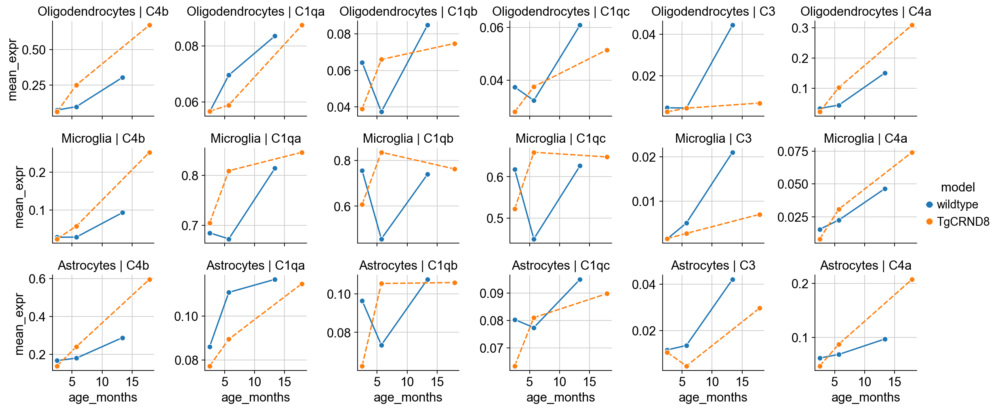
<figcaption>Xenium AD: mean expression of C4b, C1q genes, C3 and C4a over age in oligodendrocytes, microglia and astrocytes, wildtype (blue) vs TgCRND8 (orange). One section per point.</figcaption>
</figure>

<figure markdown="1">
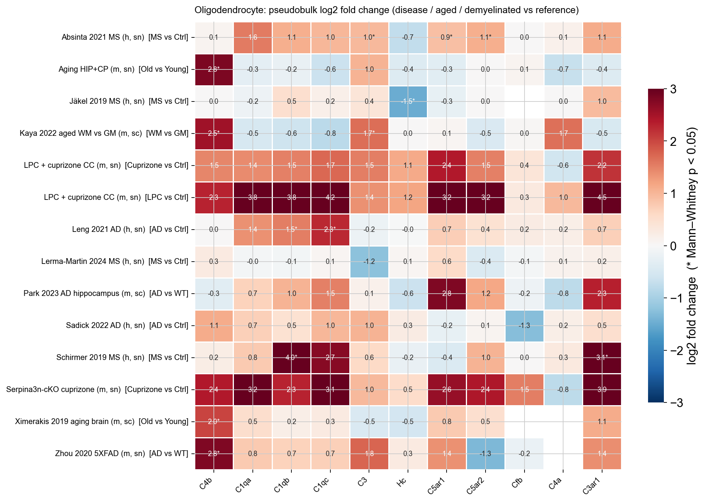
<figcaption>Public datasets, oligodendrocytes: pseudobulk log2 fold change of each complement gene for the disease / aged / demyelinated group versus its reference. Stars mark Mann–Whitney p < 0.05 across samples; unstarred values are descriptive. Human C4b cells are empty because C4A/C4B are not quantifiable.</figcaption>
</figure>

### 3.2 C5 (Hc in mouse)

Mouse: C5 transcript is detected in at most 0.5 % of cells of any type in Xenium EAE, at most 0.3 % in all eight mouse single-cell datasets and about 1–2 % of Visium / ST spots, with no disease, age or demyelination change. Human: a low glial C5 transcript is present in every human dataset (2–11 % of oligodendrocytes, 4–17 % of astrocytes and OPCs), unchanged across Braak stages and unchanged or slightly lower in MS lesions. C5 is plasma-derived; if C5a signalling matters here it has to be measured as protein (C5a, C5b-9 deposition), not as RNA.

### 3.3 C5a receptors

C5aR1 is myeloid in all nineteen datasets: 20–45 % of microglia, macrophages and infiltrating myeloid cells in EAE, 6–38 % of mouse microglia in the public data (highest in aged white matter), 3–17 % of human microglia nuclei, and at most 1 % of oligodendrocytes anywhere, including C4b⁺ disease-associated oligodendrocytes. Sorted single cells (Falcão) confirm this is not spatial spill-over: 14 of 700 C4b⁺ mature oligodendrocytes co-detect C5ar1. C5aR2 follows the same pattern at lower levels.

Per-cell C5ar1 in myeloid cells is flat from lesion core to > 500 µm in EAE, so the 3-fold tissue-level gradient toward lesions is recruitment of C5aR1⁺ cells, not receptor up-regulation. In human MS, microglial C5AR1 peaks at chronic active lesion edges (Absinta 14.5 % vs 4.5 % in control white matter; Lerma-Martin 25 % vs 8 %) and the matched Lerma-Martin Visium shows 8.5-fold higher C5AR1 in chronic active lesion spots than in control white matter.

<figure markdown="1">
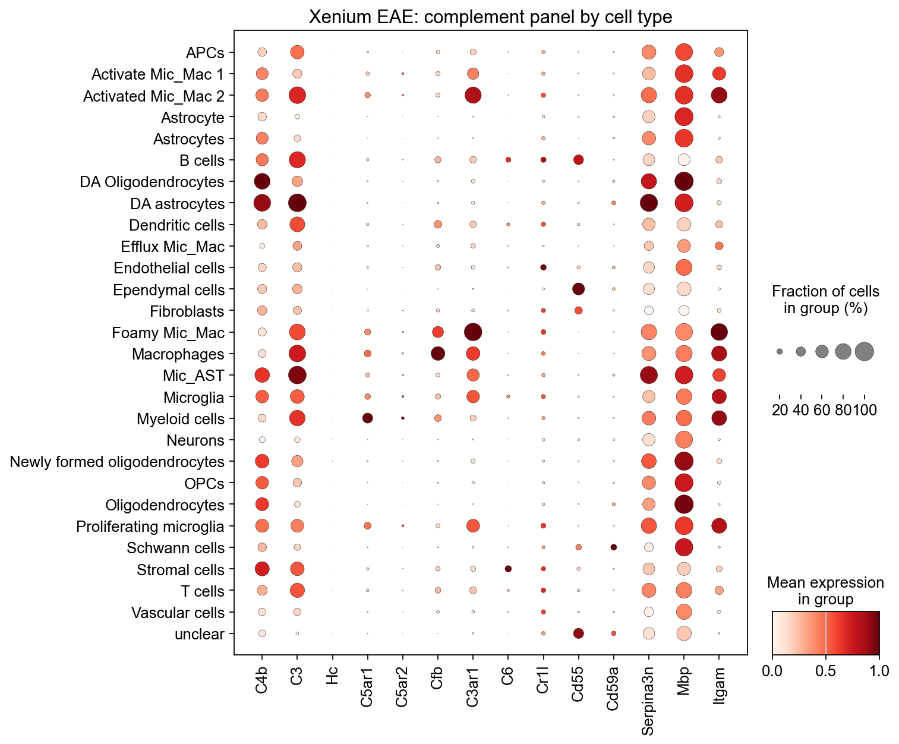
<figcaption>Xenium EAE: complement panel by cell type. C5ar1, C5ar2, Cfb and C3ar1 are confined to myeloid and immune populations; C4b is highest in disease-associated oligodendrocytes and astrocytes.</figcaption>
</figure>

<figure markdown="1">
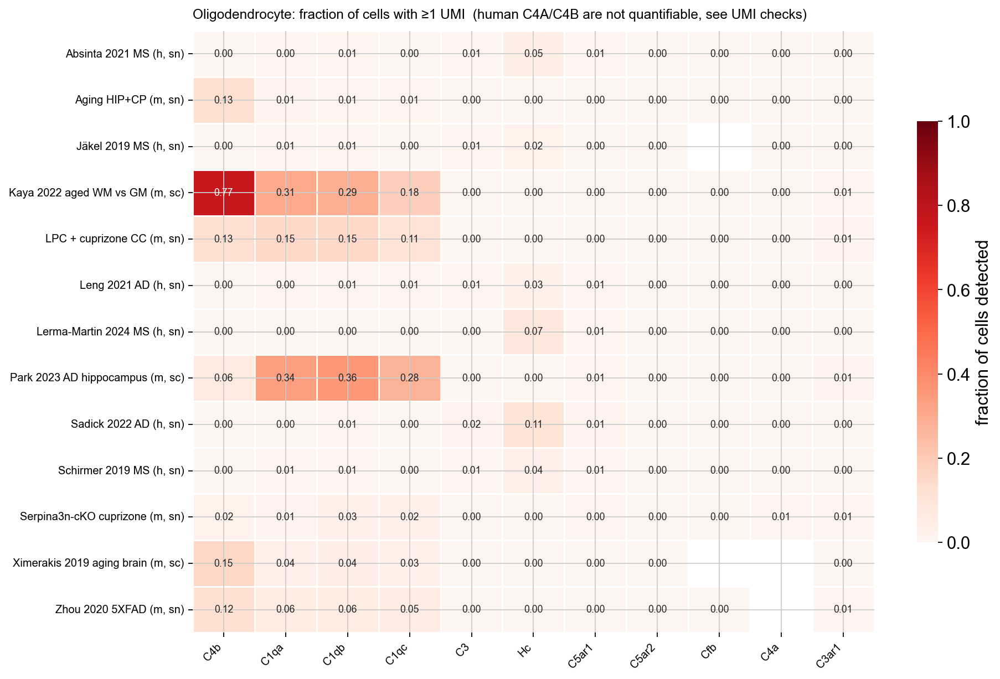
<figcaption>Public datasets: fraction of oligodendrocytes detecting each complement gene. C5 (Hc), C5ar1, C5ar2 and Cfb stay at or below 1 % in every dataset; the 30 % C1q detection in the two droplet scRNA-seq datasets (Park, Kaya) is ambient microglial RNA, absent in nuclei.</figcaption>
</figure>

<figure markdown="1">
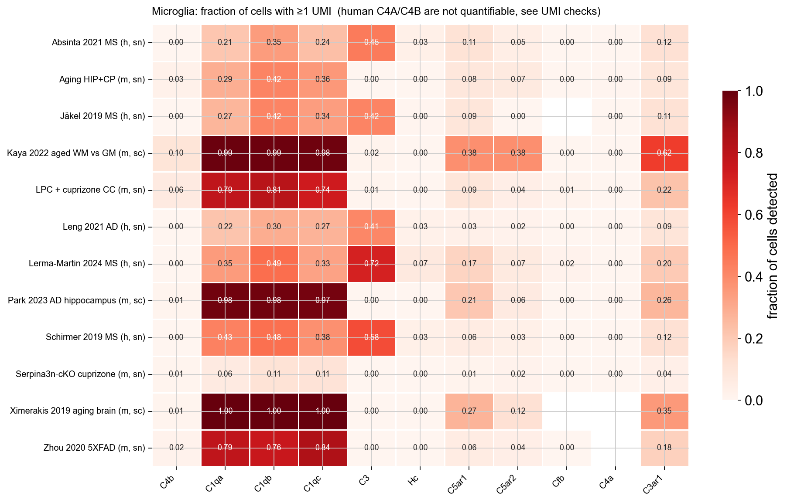
<figcaption>Public datasets: the same for microglia. C1q is near-universal in mouse microglia; C5ar1 reaches 6–38 %; Cfb is essentially absent outside active demyelination.</figcaption>
</figure>

**Spatial relationship to C4b⁺ oligodendrocytes.** In 87 EAE samples, C5aR1⁺ cells are enriched within 30 µm of C4b-high oligodendrocytes relative to C4b-negative oligodendrocytes (median ratio 2.2, paired Wilcoxon p ≈ 4×10⁻⁷; 2.0 for C5aR1⁺ myeloid cells; 1.5 for C5aR2⁺; 1.7 for Cfb⁺; 1.8 for C3aR1⁺). This is not just lesion proximity: stratifying source oligodendrocytes by lesion distance gives a median ratio of 1.96 (76 samples, 84 % above 1), and restricting to non-lesion tissue gives 2.2. Within 50–200 µm of a lesion the ratio is about 1, because everything there is myeloid-dense; at 200–500 µm and beyond it is 1.7–2.3, so away from lesions C4b-high oligodendrocytes mark myeloid-rich micro-niches.

<figure markdown="1">
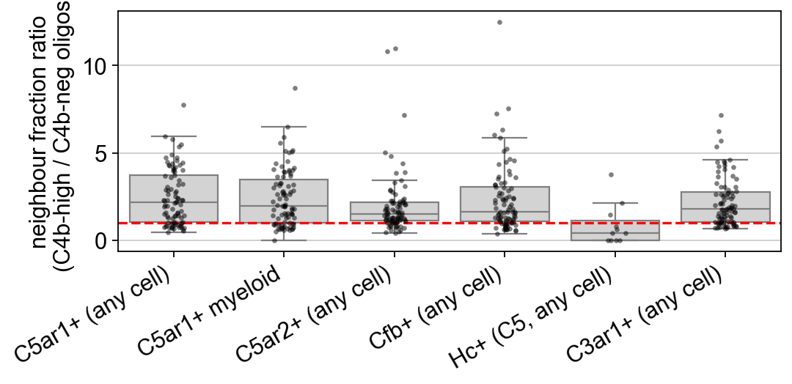
<figcaption>Xenium EAE: per-sample ratio of the fraction of receptor-positive neighbours around C4b-high versus C4b-negative oligodendrocytes (30 µm radius). Values above the dashed line mean enrichment around C4b-high cells.</figcaption>
</figure>

<figure markdown="1">
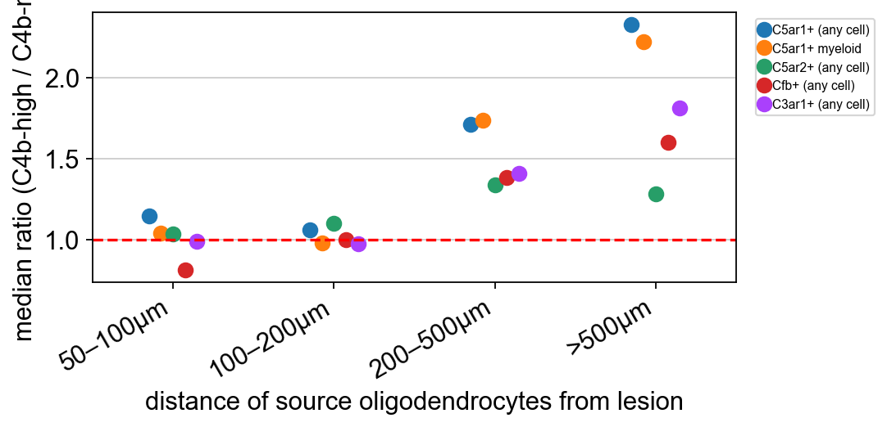
<figcaption>The same ratio after stratifying the source oligodendrocytes by their distance from the nearest lesion. The enrichment persists far from lesions.</figcaption>
</figure>

<figure markdown="1">
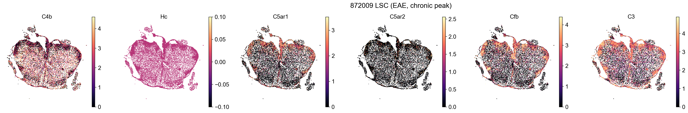
<figcaption>Xenium EAE, one chronic-peak sample: C4b, Hc (C5), C5ar1, C5ar2, Cfb and C3. The empty Hc map is real: there is essentially no local C5 transcript.</figcaption>
</figure>

### 3.4 C1q

C1q is microglial in every dataset (76–100 % of mouse microglia, 21–62 % of human microglia nuclei, higher in MS lesions than control white matter). In the Visium aging data all three C1q genes rise with age in parallel with C4b and rank among the top 50 of 16,000 genes correlated with C4b in white-matter spots; in the Chen spatial AD data they rank 11–18 of about 14,000. Inside oligodendrocyte nuclei the coupling is weak (rank 233–482 in 5XFAD, beyond 2,800 in aging). In the Xenium AD sections, C1q⁺ microglia are enriched around C4b-high oligodendrocytes only in the two oldest sections, whereas C3⁺ astrocytes are about 3-fold enriched in every section. Nuclei from active demyelinating lesions (LPC, cuprizone) carry microglial ambient RNA, so C1q, Apoe and Ctsd co-varying with C4b in those "oligodendrocytes" should not be read as intrinsic expression.

### 3.5 Cfb

Cfb is a lesion-associated myeloid gene. In EAE it is detected in 67 % of lesion macrophages and 50 % of foamy myeloid cells, is induced about 10-fold in EAE microglia (pseudobulk 0.04 → 0.44, p < 10⁻⁴), and shows a steep gradient toward lesions. In the sorted Falcão data it is the one panel gene with a modest intrinsic oligodendrocyte component: detected in 13 % of EAE-cluster mature oligodendrocytes versus 2 % of controls, about 5-fold enriched in C4b⁺ cells. Everywhere else it is silent: at most 0.2 % of microglia and 0.1 % of oligodendrocytes in every AD and aging dataset, 0.4 % of Visium spots, and in human MS only chronic-active-lesion microglia show it (2.8 % vs 0.8 %). Cfb therefore marks active inflammatory demyelination rather than the age- or amyloid-associated C4b⁺ state.

<figure markdown="1">
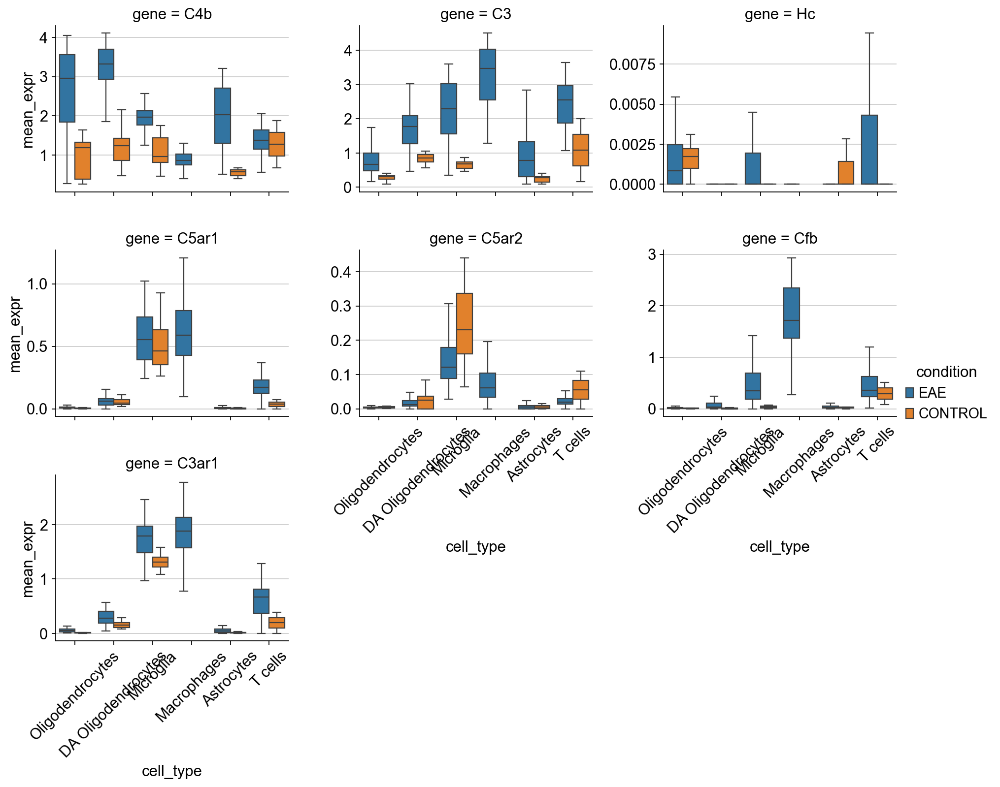
<figcaption>Xenium EAE: per-sample pseudobulk expression by cell type, EAE (orange) vs control (blue). Cfb and C3 are induced in microglia and macrophages; C5ar1 is unchanged per cell.</figcaption>
</figure>

### 3.6 Which complement genes do join the C4b⁺ oligodendrocyte program?

Ranking every gene by its correlation with C4b inside oligodendrocytes, no complement receptor, Cfb or C5 reaches the top 1,000 in any dataset. The complement genes that do are C4a (rank 1 in the spatial AD data, 4-fold detection enrichment in aged white matter) and the membrane regulators Cd59a (ranks 117–740) and Cr1l/Crry (ranks about 1,100–1,250). C4b⁺ oligodendrocytes up-regulate protection against complement deposition, not complement receptors.

<figure markdown="1">
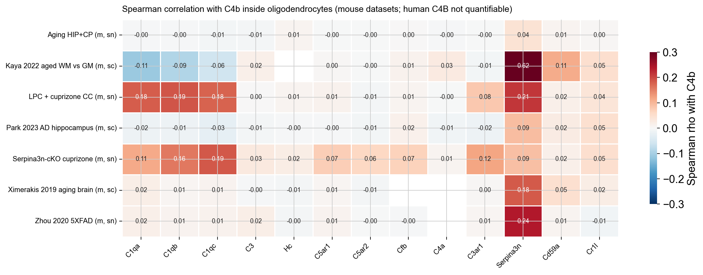
<figcaption>Spearman correlation of each complement gene with C4b inside oligodendrocytes, per mouse dataset. Serpina3n is included as the positive control of the program.</figcaption>
</figure>

<figure markdown="1">
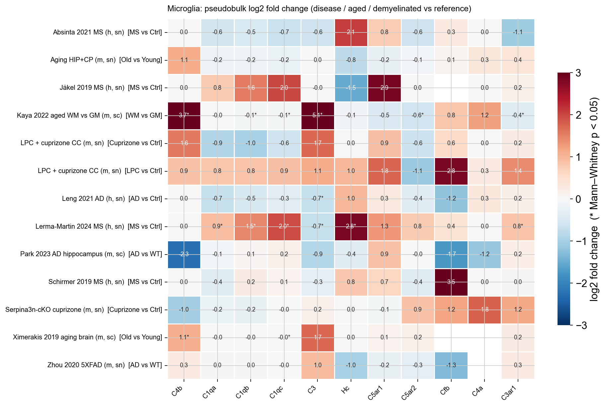
<figcaption>Public datasets, microglia: pseudobulk log2 fold change per contrast. C5ar1 tends to rise in lesion-associated microglia (LPC, human MS); C3 rises in aged white matter and falls in AD microglia; Cfb is absent outside demyelination.</figcaption>
</figure>

## 4. Integrated oligodendrocyte atlas

*Section pending: the integrated atlas is being computed (scVI/scANVI over ~190,000 oligodendrocytes from twelve datasets) and will be added when finished.*

## 5. Caveats

1. The Xenium AD time course has one section per genotype × age; those trends are descriptive.
2. The EAE neighbourhood enrichments use the existing lesion-distance calls; bins closer than 50 µm had too few C4b-negative oligodendrocytes to test.
3. Coarse cell-type annotation of eight public datasets is marker-based; only oligodendrocyte and microglia labels were validated. Park's OPC and neuron labels are unreliable, Sadick's myeloid cells fell under "Immune", and the Serpina3n-cKO cuprizone set has no usable C4b⁺ oligodendrocyte population.
4. Pseudobulk tests are underpowered where a dataset has fewer than three replicates per group (Park, LPC/cuprizone, Serpina3n-cKO, several human sets); their fold changes are descriptive.
5. Kaya's 10x libraries are all 24 months old, so that comparison is white versus grey matter in aged brain, not young versus aged.
6. Human C4A/C4B are not quantifiable in any of the eight human datasets; a multi-mapping-aware re-quantification (STARsolo with EM, or a merged C4A/C4B reference) is needed.
7. Human microglia validation in nuclei relies on author labels or on C1Q/C3 detection, because HEXB is a weak marker in snRNA-seq.

## 6. Suggested next steps

- **Protein.** C5a and C5b-9 deposition around C4b⁺ oligodendrocytes in EAE and aged white matter, since C5 cannot be read from RNA.
- **Human C4.** Re-quantify C4A/C4B from reads in the Lerma-Martin and Sadick data (the two deepest human sets) with a multi-mapping-aware method.
- **Ligand–receptor and niche modelling** between C4b⁺ oligodendrocytes and the C5aR1⁺ myeloid cells in their 30 µm neighbourhood (Csf1 and Il33 are already among the C4b correlates), on the Xenium EAE and Lerma-Martin data.
- **Cross-dataset predictive signature** of the C4b-high state with held-out validation, for a compact marker set to take to protein or spatial validation.

## 7. Where everything lives

Repository `OligoC4b` (GitHub, `christoffermattssonlangseth/OligoC4b`): executed notebooks with code and outputs under `notebooks/analysis/` (`analysis_spatial_complement_C5_C1q_Cfb`, `analysis_public_datasets_complement`, `analysis_oligodendrocyte_atlas`), the dataset loaders in `scripts/oligoc4b_public.py`, and plain-language documentation in `docs/` (`complement_findings.md`, `public_datasets.md`, `cell_type_annotation.md`, `notebooks.md`). Raw and processed data are on the group's analysis machine under `/Volumes/jamboree/OligoC4b_public/`.
